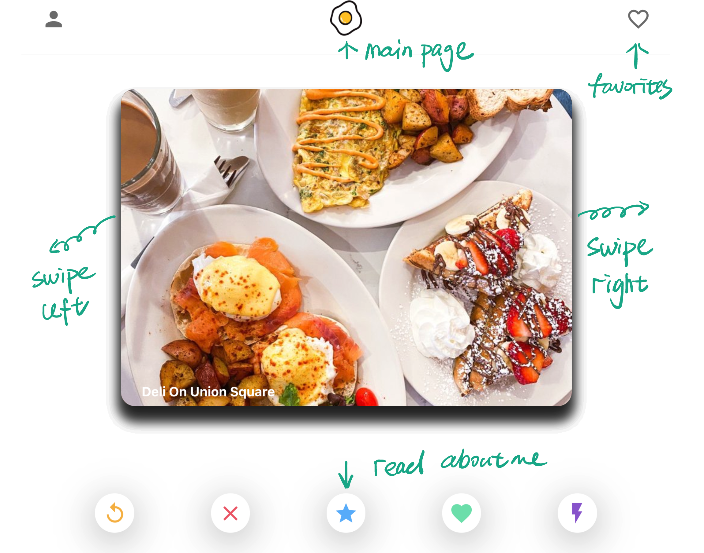
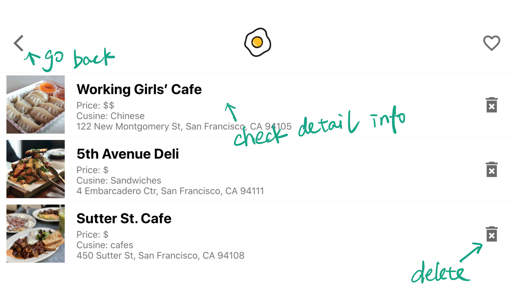
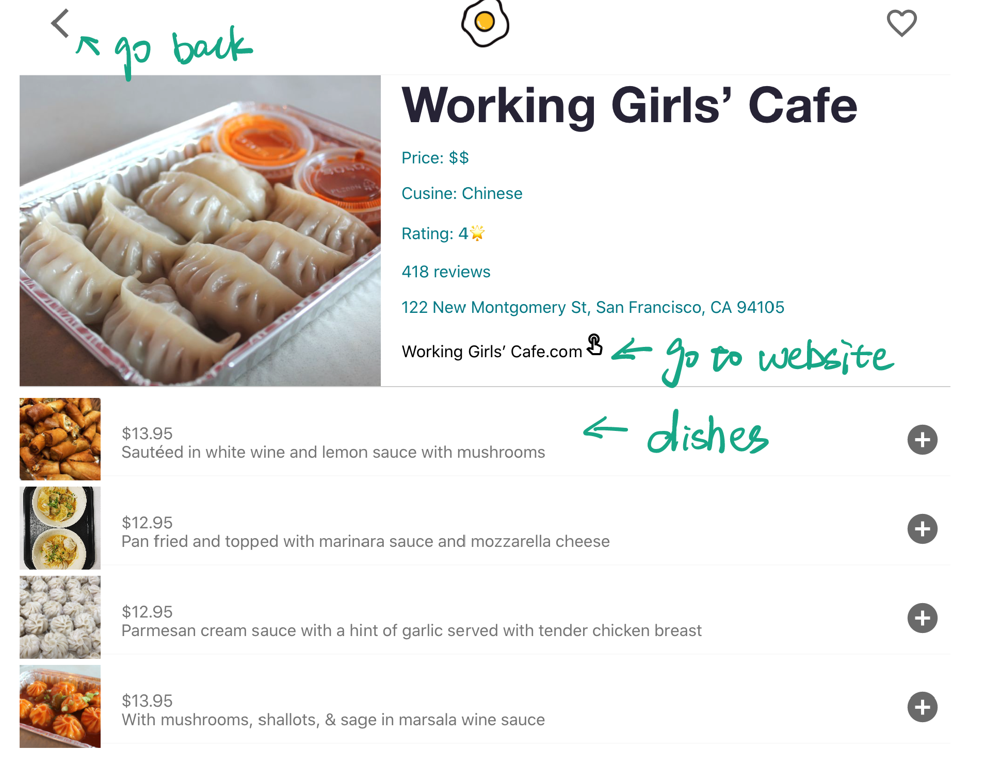
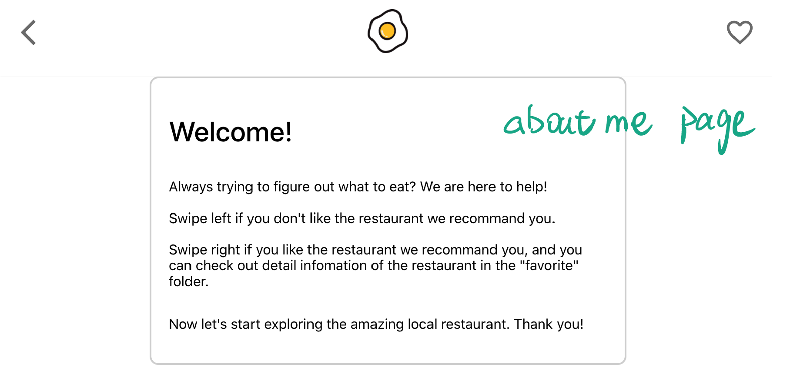

# What to eat-client

Live Deployment

[https://what-to-eat-beta.vercel.app/](https://what-to-eat-beta.vercel.app/)

## Main feature

- User can swipe left to unlike the restaurant, swipe right to the like the restaurant and save it to favorites
- User can view the restaurants in favorites
- User can remove the restaurants in favorites
- User can view each favorite restaurant info and menu.

## Technology used

### Frontend

- ReactJS
- React Router
- React Context
- React Hooks
- HTML
- CSS
- Webpack
- Jest
- Deployed at Vercel

### Backend

- RESTful API
- Node & Express
- PostgresSQL
- Knex
- Supertest
- Mocha & Chai
- Deployed Heroku
